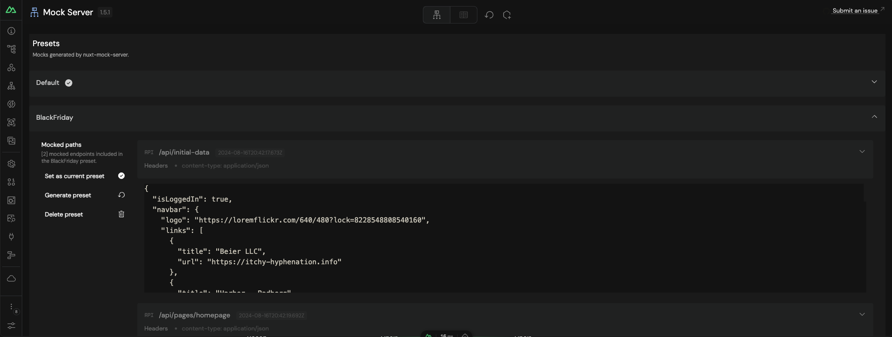

[![Contributors][contributors-shield]][contributors-url]
[![Forks][forks-shield]][forks-url]
[![Stargazers][stars-shield]][stars-url]
[![Issues][issues-shield]][issues-url]
[![MIT License][license-shield]][license-url]

[![Nuxt][Nuxt]][Nuxt-url]
[![Vue][Vue.js]][Vue-url]

# nuxt-mock-server

  

This module provides an easy way to setup mocks for `nuxt`.

Check the <a href="https://soaresmg.github.io/nuxt-mock-server/">documentation</a> for more information and examples.

  

Heavily inspired in [@nuxt/sitemap](https://github.com/nuxt-modules/sitemap).

## Roadmap

| Status | Topic | Goal | Milestone |
| :---: | :--- | :--- | :--- |
| ✔ | Formats | Support `application/json` | Q3 2024
| ✔ | Formats | Support `text/plain` | Q3 2024
| ✔ | Formats | Support `text/html` | Q3 2024
| ❌ | Formats | Support `application/xml` | Q3 2024
| ✔ | Formats | Support `application/octet-stream` | Q3 2024
| ❌ | Tests | Add proper tests | Q3 2024
| ✔ | DX | Improve docs | Q3 2024
| ❌ | DX | Non-root (e.g monorepo) support for mock directory | Q3 2024
| ✔ | DX | Add devtools page | Q3 2024
| ✔ | DX | Add mock updates through devtools | Q3 2024
| ❌ | Formats | Custom formats | Q4 2024
| ✔ | Core | Iterate `prerender` routes to generate mocks on server init | Q4 2024
| ✔ | Core | Support presets (mock bundles that can be switched) | Q4 2024
| ❌ | Core | Support remote shared servers | Q1 2025

See the [open issues](https://github.com/SoaresMG/nuxt-mock-server/issues) for a full list of proposed features (and known issues).

<!-- MARKDOWN LINKS & IMAGES -->
<!-- https://www.markdownguide.org/basic-syntax/#reference-style-links -->
[contributors-shield]: https://img.shields.io/github/contributors/SoaresMG/nuxt-mock-server.svg?style=for-the-badge
[contributors-url]: https://github.com/SoaresMG/nuxt-mock-server/graphs/contributors
[forks-shield]: https://img.shields.io/github/forks/SoaresMG/nuxt-mock-server.svg?style=for-the-badge
[forks-url]: https://github.com/SoaresMG/nuxt-mock-server/network/members
[stars-shield]: https://img.shields.io/github/stars/SoaresMG/nuxt-mock-server.svg?style=for-the-badge
[stars-url]: https://github.com/SoaresMG/nuxt-mock-server/stargazers
[issues-shield]: https://img.shields.io/github/issues/SoaresMG/nuxt-mock-server.svg?style=for-the-badge
[issues-url]: https://github.com/SoaresMG/nuxt-mock-server/issues
[license-shield]: https://img.shields.io/github/license/SoaresMG/nuxt-mock-server.svg?style=for-the-badge
[license-url]: https://github.com/SoaresMG/nuxt-mock-server/blob/master/LICENSE.txt
[Nuxt]: https://img.shields.io/badge/nuxt-000000?style=for-the-badge&logo=nuxt&logoColor=white
[Nuxt-url]: https://nuxt.com/
[Vue.js]: https://img.shields.io/badge/Vue.js-35495E?style=for-the-badge&logo=vuedotjs&logoColor=4FC08D
[Vue-url]: https://vuejs.org/